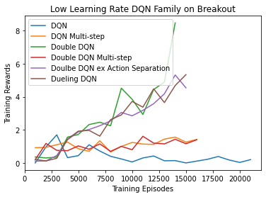
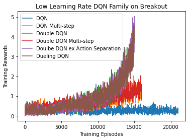

# Group Project






## General Notes
To implement a new agent and/or model one should just need to create a new file as outlined below with a couple functions implemented.
Most things like a general training loop and collecting statistics during training are taken care of by agent\_runner.py or agent.py.
Hopefully this allows us to just implement model/agent specific things and not have to worry about the infrastructure.

## Project Goals
- Benchmark numerous agent types across discrete and continuous games
- Models considered:
-- DQN Models:
- "Vanilla" DQN
- Dueling DQN
- Dueling Double DQN

-- Policy Gradient Models:
- MC (REINFORCE)
- PPO
- "Vanilla"

Tasks:
- https://gym.openai.com/envs/BipedalWalker-v2/
- https://gym.openai.com/envs/Breakout-v0/

## Implementing a new agent

### Copy agents/sample\_agent.py to a new file
* Create a new agent file in the agents directory

### Implement __init__
* Create your optimizer and assign to self.optimizer
* Create your loss function and assign to self.criterion
* Perform any other agent specific items needed
    * EX:  In DQN you would create your target model as seen in sample\_agent.py here

### Implement make\_action 
* Note that epsilon and test are passed as arguments here

### Implement push
* The buffer already exists for your agent so you could just use copy the line in the sample\_agent.py unless you have specific functionality to perform

### Implement replay\_buffer
* Again, you likely will just need to copy the method from sample\_agent.py

### Implement can\_train
* This called at each step within an episode
* Return True if the agent is able to be trained
* Return False if the agent is not able to be trained
* EX:  For DQN, you would return False until you have enough entries in your replay buffer as seen in the sample\_agent

### Implement train
* This is called at each step of the training loop if can\_train is True

* Pseudocode from agent\_runner.py:

```
for episode:
    for step:
       train() <--- This method
```

* The current tuple for the step is provided and any training should be performed here
* This is where you calculate loss and perform gradient descent
* EX:  In sample\_agent you will see this is where we use the replay buffer etc...
* NOTE:  The loss should be returned at the end of this function

## Implementing a new model
* This really just involves creating a normal torch model in the models directory
* See sample\_model.py for an example

## Get Listing of Available Models and Agents
```
python main.py --list
```
## Executing training
This remains largely unchanged from Project 3 though there are some required arguments and lots more optional arguments

### General Command
```
python main.py --train_dqn --agent sample_agent.SampleAgent --model sample_model.SampleModel --run_name training_run 
```

### Archive
After a run is executed a directory "archive" is created with data from each run performed.
The directory name is made from whatever argument is passed in for run\_name with the date appended to the end.

## Executing test
This uses the test\_dqn argument as well as arguments to indicate which save model and optimizer to use

```
python main.py --test_dqn --agent sample_agent.SampleAgent --model sample_model.SampleModel --run_name test_run --model_path ./archive/training_run/my_model.pth --optimizer_path ./archive/training/my_optimizer.pth
```
